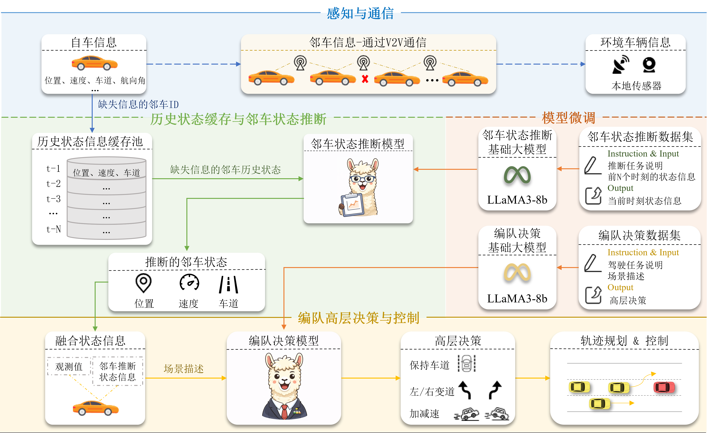

# 通信有损场景下基于LLM的编队鲁棒控制方法

## 引言
针对V2V通信丢包易导致邻车状态信息突发缺失、决策退化和编队稳定性下降等问题，本章提出了通信有损场景下基于LLM的编队鲁棒控制方法。引入历史状态信息缓存池和邻车状态推断模型（Neighbor Vehicle State Inference Model，NVSIM），通过邻车历史状态信息推断出邻车缺失状态，结合轻量化微调的编队决策模型（Convoy Decision Model，CDM）增强高层决策的合理性和可靠性。同时，针对性构建两类定向数据集——邻车状态推断数据集与编队决策数据集，分别为NVSIM的时序状态推断能力、CDM的复杂场景决策能力提供高质量训练支撑。
## 框架图

+ **感知与通信模块**：接收车辆当前状态和邻车状态，并模拟 V2V 通信丢包情况。

+ **历史状态缓存与邻车状态推断模块**：保存邻车历史轨迹信息，在通信丢包时根据历史信息推断当前位置、速度、车道等状态。

+ **编队高层决策与控制模块**：将真实状态和推断结果输入大模型，输出高层动作，保证车队稳定跟踪执行。

+ **模型微调模块**：对基础大模型进行定制微调。

---

## 数据集

仓库中构建了两类用于微调的数据集：

### 邻车状态推断数据集

用于训练模型从历史状态中恢复缺失的邻车信息。

### 编队决策数据集

用于训练模型根据当前场景输出车队决策。

这两类数据都是在 SUMO 仿真环境中构建的。

---

## 模型说明

* 基座模型：**LLaMA3-8B**
* 微调方式：**LoRA**
* 训练框架：**LLaMA-Factory**
---

## 目录结构

```text
LoRAConvoy/
├── config.yaml      # 配置文件
├── run.py           # 主入口
├── reasoning/       # 推理与决策相关代码
├── dataset/         # 数据集
├── sumo/            # SUMO 仿真相关文件
└── README.md
```

---

## 快速开始

### 1. 安装依赖

```bash
pip install -r requirements.txt
```

### 2. 修改配置

根据需要调整 `config.yaml` 中的参数。

### 3. 启动运行

```bash
python run.py
```

---
